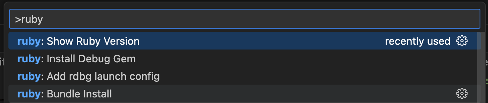

# ironin-vsc-ruby-rails README

Simple extension for Visual Studio Code that adds sample Ruby and Ruby on Rails features.

## Features

Currently implmented Ruby features (as tasks or commands):
- Show Ruby Version
- Bundle Install
- Run Ruby File

Easily add new tasks and commands by modifying `rubyTasks.json`

### Tasks

### Commands

## Known Issues

None

## Release Notes

### 0.1.0

Initial release
